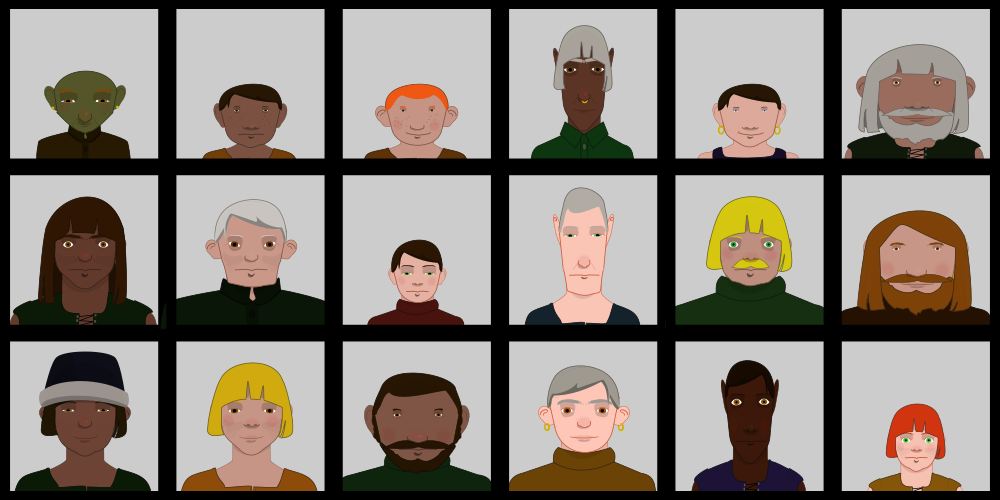

This is a template based procedural face generator that uses some cute tricks to turn a relatively small set of hand drawn feature prototypes into a relatively large diversity of output faces.

This project was largely an excuse to learn rust for me, so maybe don't look at the code but instead look at these faces. I'm still kind of pleased with them even years later:



There are more examples of the system's output over the course of development in the [examples](./examples) directory.

To run it yourself install the rust build tools and go:
```sh
cargo run > output.svg
```
